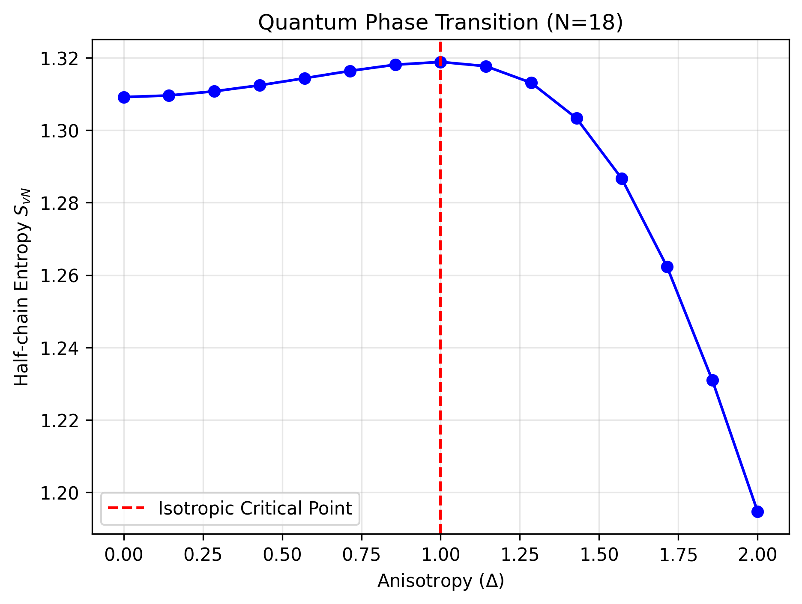
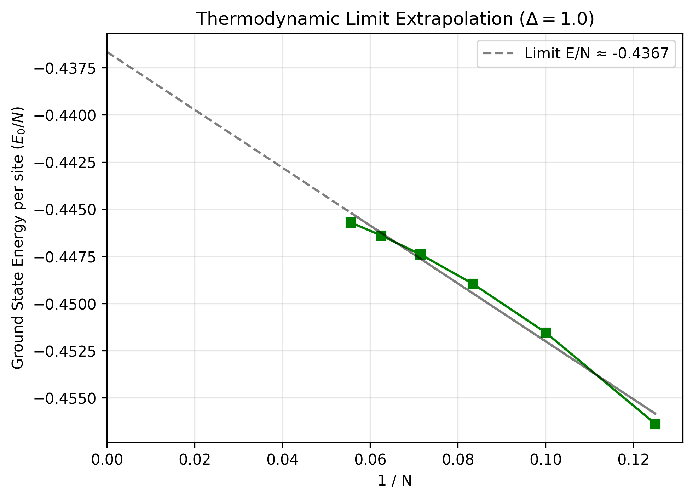

# Exact Diagonalization of the 1D XXZ Spin Chain

This repository contains a custom Exact Diagonalization (ED) solver built in Python. It is designed to compute the ground-state properties and quantum entanglement metrics of the 1D XXZ Heisenberg model using sparse matrix operations and bitwise symmetry reduction.

## The Model

The system is described by the 1D XXZ Hamiltonian:

$$H = \sum_{i=1}^{N} \Big[ \frac{J}{2} (S_i^+ S_{i+1}^- + S_i^- S_{i+1}^+) + \Delta S_i^z S_{i+1}^z \Big]$$

Where:
*   $J$ is the exchange coupling (set to $1.0$).
*   $\Delta$ is the anisotropy parameter driving the quantum phase transition.
*   Periodic boundary conditions are enforced.

## Computational Methodology

To bypass the exponential memory bottleneck of the full $2^N$ Hilbert space, this solver implements:
1.  **$U(1)$ Symmetry Sectoring:** Restricts the basis strictly to the half-filling sector ($m^z = 0$) where the ground state resides. For $N=14$, this reduces the matrix dimension from 16,384 to 3,432.
2.  **Bitwise State Representation:** Translates local spin-flip operators ($S_i^+ S_{i+1}^-$) into highly efficient CPU-level bitwise masks (`^`, `<<`, `|`) to construct the sparse Hamiltonian matrix natively in the reduced subspace.
3.  **Lanczos Algorithm:** Extracts the lowest algebraic eigenvalue and eigenvector without storing dense matrices, leveraging `scipy.sparse.linalg.eigsh`.
4.  **Singular Value Decomposition (SVD):** Computes the half-chain von Neumann entanglement entropy ($S_{vN}$) by mapping the compressed ground state back to the full Hilbert space and evaluating the reduced density matrix.

## Key Results

### 1. Quantum Phase Transition
By scanning the anisotropy parameter $\Delta$, the solver successfully captures the transition between the critical gapless XY phase ($\Delta < 1$) and the gapped antiferromagnetic Neel phase ($\Delta > 1$). The phase boundary is cleanly identified by the sharp cusp in the half-chain entanglement entropy at the isotropic point ($\Delta = 1.0$).

### 2. Finite-Size Scaling
To approximate the thermodynamic limit ($N \to \infty$), the ground state energy per site ($E_0/N$) is calculated for system sizes $N \in \{8, 10, 12, 14\}$ at the isotropic point. A linear extrapolation against $1/N$ provides the infinite-chain limit estimate.

## Dependencies
* `numpy`
* `scipy`
* `matplotlib`
